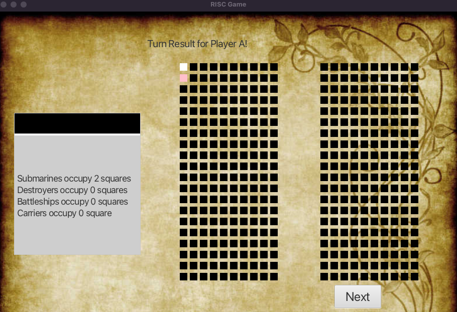

# ECE651 Battleship
Luxin Zhang
Apr.21, 2023

## Networked Game

Branch: network

In this branch, I purely implement the networked game with two players connected with the server.
I implemented it with the socket as in the RISC Game.

1. Networked game with two players
2. The accounts part (realized in the ui_grid branch), set up as a login page.

## Graphical User Interface
****
Branch: ui_grids
****
In this branch, I implement the text-based game with GUI. I chose the classical mode for this GUI.
Here is several Pictures of each page
1. Start Page: I implemented the start page with user interaction. When one of the player clicked the game,
the page shows wait information.

[//]: # (![Start Page.png]&#40;PagePics%2FStart%20Page.png&#41;)

2. Login Page: The user needs to type the username and password, if one of them incorrect, it shows 
error in the top.

3. The Phrase page: this page needs the user to type the string where to place the ship initially. 
In order to make it more like real game, I listed all the ships but the user does not need to place
all of them. **Note that the user needs to type return after she/he finishes the input**

- Ships are differentiated in color, the pink color is for Submarines, Blue for Destroyers, Green for 
Battleships, and Yellow for Carriers. 
- Here is the picture after placement

4.  Action Pages: Fire Page, Sonar Page and Move Page
- Fire Page:

- Move Page:

- Sonar Page:

5. Turn Results: Fire, Sonar, Move
- Fire Result:

- Move Result:

- Sonar Result:

- Sunk Ship Result:

6. Game Result Page: Shows the final game results. THe player can exit by clicking the QUIT button.

# Battleship
